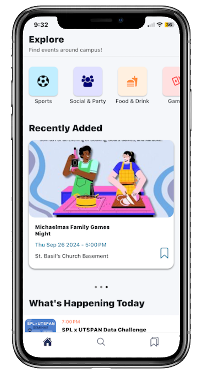
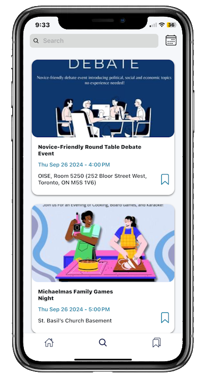
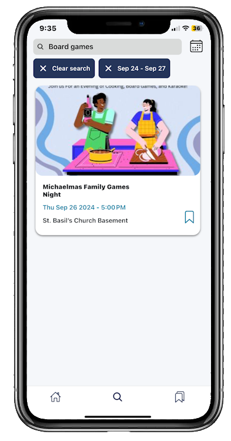
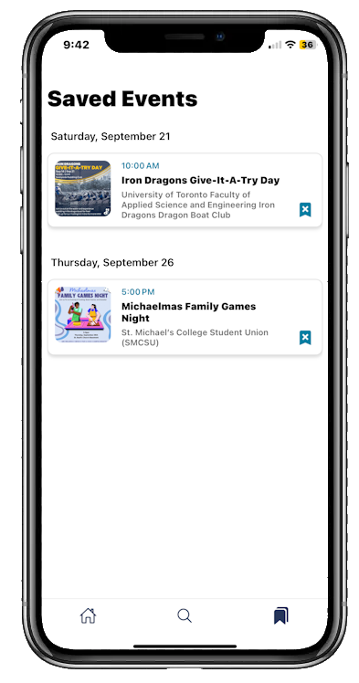
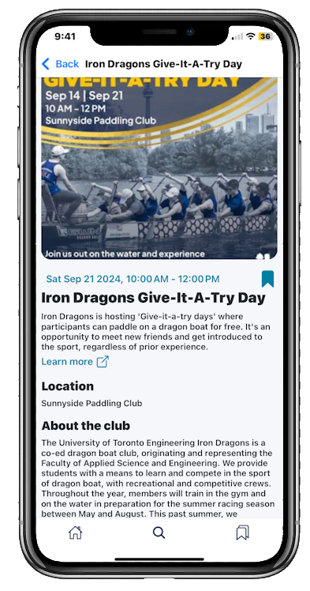

## Eventnest | UofT Events Hub
<!-- TABLE OF CONTENTS -->

  
Table of Contents

  <ol>
    <li>
      <a href="#about-the-project">About The Project</a>
      <ul>
        <li><a href="#motivation">Motivation</a></li>
        <li><a href="#built-with">Built With</a></li>
      </ul>
    </li>
    <li><a href="#usage">Usage</a></li>
    <li><a href="#roadmap-future-additions">Roadmap</a></li>
  </ol>

<!-- ABOUT THE PROJECT -->

### About The Project

<!-- ![Product Name Screen Shot][product-screenshot] -->
<table>
  <tr>
    <td valign="top" rowspan="2"></td>
    <td valign="top"></td>
  </tr>
  <tr>
        <td valign="top"></td>
  </tr>
</table>

**Eventnest** serves as a centralized hub for students at the UofT St. George campus to easily discover and engage with extracurricular events. By aggregating real-time event information, the app simplifies the process of finding activities that match students' interests, helping them engage in the campus community.

### Motivation

We thought an app like this could help a lot of students who, like us, often struggled to stay updated on the wide range of extracurricular events happening around campus. Navigating student life at UofT can be overwhelming, and we wished there had been a tool to easily find activities that matched our interests. By building this app, we wanted to create something that would simplify the process and encourage students to engage more with their community, making it easier to explore opportunities and feel connected to campus life.

### Built With

[![React Native][Reactnative]][Reactnative-url]
[![Expo][Expo]][Expo-url]
[![CSS][CSS]][css-url]
[![Python][Python]][Python-url]
[![Django][Django]][Django-url]
[![OpenAI][OpenAI]][OpenAI-url]

<!-- USAGE EXAMPLES -->

### Usage

Below are screenshots of the several screens and features of Eventnest. We emphasized simplicity for the users in this app. Students can just download the app and quickly start browsing through events - no need to sign up or onboard.

  
  
  
  

<!-- ROADMAP -->

### Roadmap (Future Additions)

- [ ] Clubs page
    - [ ] Search events by club/organization
- [ ] Smoother and faster aggregation of events

<!-- MARKDOWN LINKS & IMAGES -->
<!-- https://www.markdownguide.org/basic-syntax/#reference-style-links -->

[product-screenshot]: images/home-page.png
[CSS]: https://img.shields.io/badge/CSS-239120?&style=for-the-badge&logo=css3&logoColor=white
[css-url]: https://reactnative.dev/docs/stylesheet
[Reactnative]: https://img.shields.io/badge/ReactNative-222222?style=for-the-badge&logo=React&logoColor=
[Reactnative-url]: https://reactnative.dev/
[Expo]: https://img.shields.io/badge/Expo-000020?style=for-the-badge&logo=expo&logoColor=white
[Expo-url]: https://docs.expo.dev/
[Python]: https://img.shields.io/badge/python-3670A0?style=for-the-badge&logo=python&logoColor=ffdd54
[Python-url]: https://www.python.org/
[Django]: https://img.shields.io/badge/Django-092E20?style=for-the-badge&logo=django&logoColor=green
[Django-url]: https://www.djangoproject.com/
[OpenAI]: https://img.shields.io/badge/-OpenAI%20API-eee?style=flat-square&logo=openai&logoColor=412991
[OpenAI-url]: https://openai.com/index/openai-api/
